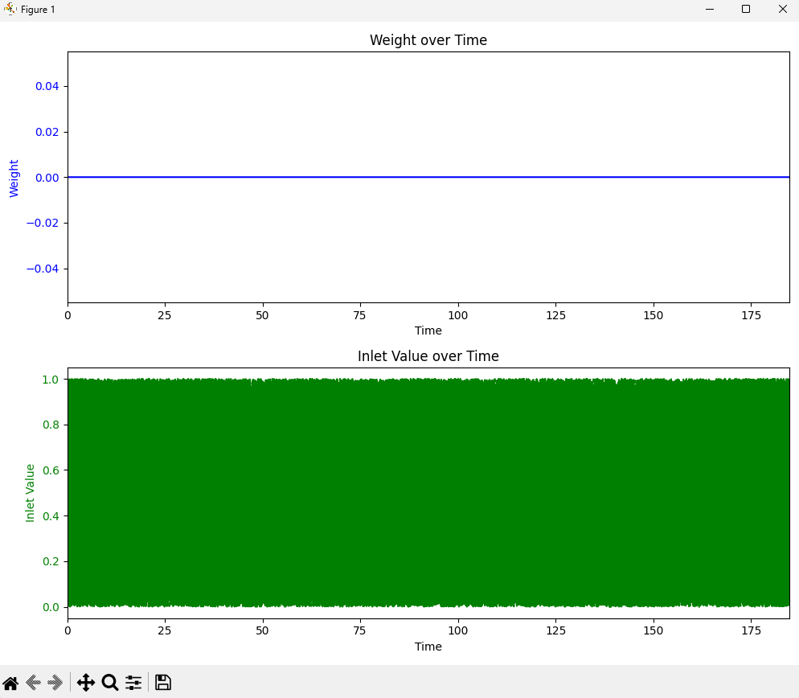

# EEG_experiment
Program for obtaining measure data for EEG and strain gauge

[Links for installation files](https://disk.yandex.ru/d/qwSaNUuUulowKQ)

To install on a random PC:
1) install Python v3+  
        [Link](https://www.python.org/)
3) download this repo and unpack
4) go to project directory
5) create virtual environment  
    `python -m venv myenv`
6) activate virtual environment  
    `.\myenv\Scripts\Activate`
7) install packages  
    `pip install pyserial pylsl`  
    (optionally, for plots) `pip install pandas matplotlib`
8) run program, do staff, stop program
9) stop virtual environment  
    `deactivate`

Plot example over 180 seconds of time synchro:

